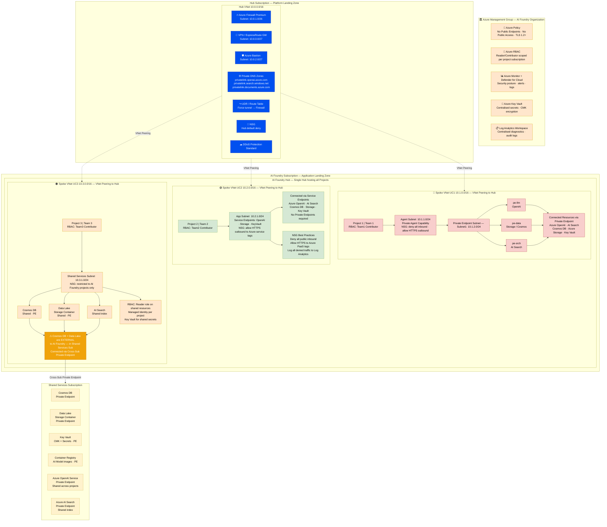

# Azure Landing Zone – AI Foundry Best Practices (3 Use Cases)

---

## Legend

| Colour | Meaning |
|---|---|
| 🔵 Blue | Hub networking components (Firewall, Bastion, DNS, etc.) |
| 🔴 Red/Pink | UC1 – Private Agent (highest security, private endpoints only) |
| 🟢 Green | UC2 – LLM + AI Search (service endpoints, standard tier) |
| 🟠 Orange | UC3 – Shared Agent Resources (cross-sub access, read-only) |
| 🟡 Yellow | Shared Services (Cosmos DB, Data Lake, Key Vault, ACR) |
| 🔶 Amber | Governance & Policy (Management Group level controls) |
