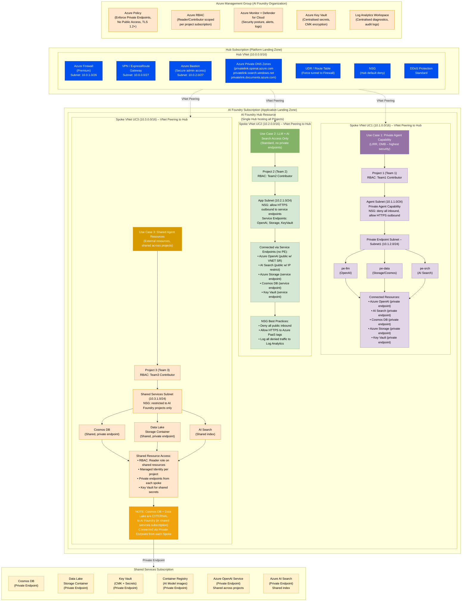

# Azure Landing Zone – AI Foundry Best Practices (3 Use Cases)

---

## Legend

| Colour | Meaning |
|---|---|
| 🔵 Blue | Hub Networking (Firewall, Bastion, DNS, VPN, UDR, NSG, DDoS) |
| 🔴 Pink/Purple | UC1 – Private Agent (highest security, private endpoints only) |
| 🟢 Green | UC2 – LLM + AI Search (service endpoints, no private endpoints) |
| 🟠 Orange | UC3 – Shared Agent Resources (cross-sub, read-only Managed Identity) |
| 🟡 Yellow | Shared Services (Cosmos DB, Data Lake, Key Vault, ACR, OpenAI, AI Search) |
| 🔶 Amber | Governance / Policy (Management Group level controls) |
